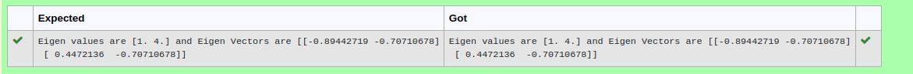

# EIGENVALUES-AND-EIGENVECTORS
## Aim:
To write a python program to find the Eigenvalues and Eigen Vectors
## Equipment’s required:
1. 	Hardware – PCs
2. 	Anaconda – Python 3.7 Installation / Moodle-Code Runner
## Algorithm:
### Step1 : 
Import numpy as np
### Step 2: 
Get array input from user
### Step 3: 
Using the np.linalg.eig(),  we get two results (first is eigenvalue and second is eigenvector) of the given matrix.
### Step 4: 
Print the program
## Program:#Program to find the eigen values and eigen vectors.
```
#Developed by: Thirukaalathessvarar S
#RegisterNumber: 22004529

import numpy as np
a=np.array([[2,2],[1,3]])
value,vector=np.linalg.eig(a)
print("Eigen values are {} and Eigen Vectors are {}".format(value,vector))

```
## Output:


## Result:
Thus the Eigenvalue and Eigenvector is successfully solved using python program
